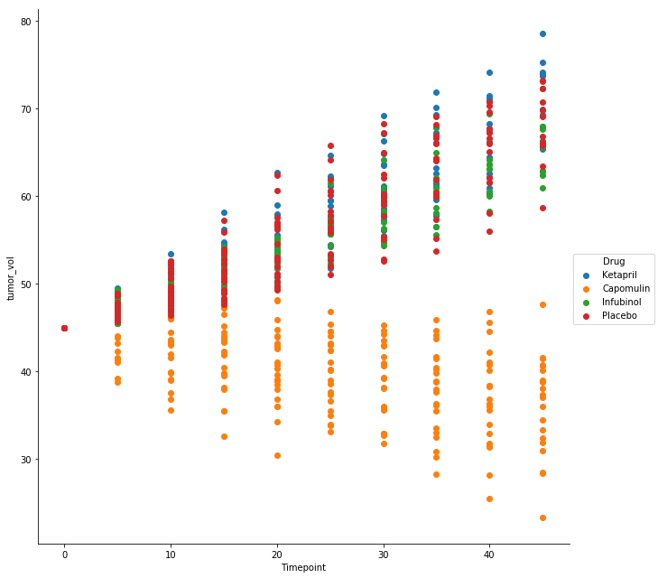

## Summary
- Of the three drugs studied, Capomulin performed best in terms of survival of subjects, lower number of metasases, and slowing or reversing progression of tumor volume.  
- The study subset of interest began with 100 subjects, 25 assinged to each of the three drugs and 25 assigned to placebo.
- The final surviving number of mice at the ending timepoint -- 45 days -- was 52. Of that surviving group, 21 of those were subjects assigned to Capomulin, 11 were from placebo, 11 from Ketapril, and 9 from Infubinol. 


```python
import pandas as pd
import seaborn as sns
import matplotlib.pyplot as plt
import numpy as np
from scipy import stats
%matplotlib inline
```


```python
drugsdf = pd.read_csv('raw_data/mouse_drug_data.csv')
tumors = pd.read_csv('raw_data/clinicaltrial_data.csv')
```

## Preprocessing


```python
data = pd.merge(drugsdf, tumors, how='inner')

data = data.rename(columns={\
                            'Mouse ID': 'mouse_id',\
                            'Tumor Volume (mm3)': 'tumor_vol',\
                            'Metastatic Sites': 'mets'})

drugs = ['Capomulin', 'Infubinol', 'Ketapril', 'Placebo']
mask_drugs = data['Drug'].isin(drugs)


data_drugs = data[mask_drugs]
```

## Tumor Volume
Scatter plot: tumor volume changes over time for each treatment 


```python
capomulin = data[data.Drug == "Capomulin"]
infubinol = data[data.Drug == "Infubinol"]
ketapril = data[data.Drug == "Ketapril"]
placebo = data[data.Drug == "Placebo"]
```


```python
sns.FacetGrid(data_drugs, hue="Drug", size=9,) \
   .map(plt.scatter, "Timepoint", "tumor_vol") \
   .add_legend();
```





```python
tumorfig = plt.figure(figsize=(20, 10))

axes1 = tumorfig.add_subplot(2, 2, 1)
axes2 = tumorfig.add_subplot(2, 2, 2)
axes3 = tumorfig.add_subplot(2, 2, 3)
axes4 = tumorfig.add_subplot(2, 2, 4)

axes1.plot(capomulin['Timepoint'], capomulin['tumor_vol'], 'o')
axes2.plot(infubinol['Timepoint'], infubinol['tumor_vol'], 'o')
axes3.plot(ketapril['Timepoint'], ketapril['tumor_vol'], 'o')
axes4.plot(placebo['Timepoint'], placebo['tumor_vol'], 'o')

axes1.set_title("Capomulin")
axes2.set_title("Infubinol")
axes3.set_title("Ketapril")
axes4.set_title("Placebo")

tumorfig.text(0.5, 0.07, 'Timepoint (days)', ha='center', va='center')
tumorfig.text(0.07, 0.5, 'Tumor Volume (mm3)', ha='center', va='center', rotation='vertical')

tumorfig.subplots_adjust(top=0.90)
tumorfig.suptitle("Tumor Volume Data", fontsize=30);
```


## METASTASES
Scatter plot: number of metastatic sites - changes over time for each treatment


```python
metfig = plt.figure(figsize=(10, 8))

axes1 = metfig.add_subplot(2, 2, 1)
axes2 = metfig.add_subplot(2, 2, 2)
axes3 = metfig.add_subplot(2, 2, 3)
axes4 = metfig.add_subplot(2, 2, 4)

axes1.plot(capomulin['Timepoint'], capomulin['mets'], 'o')
axes2.plot(infubinol['Timepoint'], infubinol['mets'], 'o')
axes3.plot(ketapril['Timepoint'], ketapril['mets'], 'o')
axes4.plot(placebo['Timepoint'], placebo['mets'], 'o')

axes1.set_title("Capomulin")
axes2.set_title("Infubinol")
axes3.set_title("Ketapril")
axes4.set_title("Placebo")

metfig.text(0.5, 0.04, 'Timepoint (days)', ha='center', va='center')
metfig.text(0.06, 0.5, 'Metasteses (number)', ha='center', va='center', rotation='vertical')

metfig.subplots_adjust(top=0.90)
metfig.suptitle("Metastases Data", fontsize = 20);

#what is a better way to show the metastatic site changes?? 
```


## SURVIVAL RATE

Scatter plot: number of mice still alive through the course of treatment


```python
subjects = data_drugs.groupby('mouse_id')
```


```python
srdf = data_drugs.copy()
srdf = srdf.drop('mets', axis=1)
srdf = srdf.drop('tumor_vol', axis=1)

srdf['observed'] = np.where(srdf['Timepoint'] == 45, 1 , 0)
#wth is wrong with this when 1 and 0 are switched

duration = subjects.Timepoint.last() - subjects.Timepoint.first()

sr = srdf.groupby('mouse_id')['observed'].sum().astype(float)
sr = sr.to_frame()
sr = sr.round(1)

sr['dur'] = duration.astype(float)

sr.head()
```


<div>
<style scoped>
    .dataframe tbody tr th:only-of-type {
        vertical-align: middle;
    }

    .dataframe tbody tr th {
        vertical-align: top;
    }

    .dataframe thead th {
        text-align: right;
    }
</style>
<table border="1" class="dataframe">
  <thead>
    <tr style="text-align: right;">
      <th></th>
      <th>observed</th>
      <th>dur</th>
    </tr>
    <tr>
      <th>mouse_id</th>
      <th></th>
      <th></th>
    </tr>
  </thead>
  <tbody>
    <tr>
      <th>a203</th>
      <td>1.0</td>
      <td>45.0</td>
    </tr>
    <tr>
      <th>a251</th>
      <td>1.0</td>
      <td>45.0</td>
    </tr>
    <tr>
      <th>a262</th>
      <td>1.0</td>
      <td>45.0</td>
    </tr>
    <tr>
      <th>a457</th>
      <td>0.0</td>
      <td>10.0</td>
    </tr>
    <tr>
      <th>a577</th>
      <td>0.0</td>
      <td>30.0</td>
    </tr>
  </tbody>
</table>
</div>


```python
drugsdf = drugsdf.rename(columns={'Mouse ID': 'mouse_id'})
sr = sr.reset_index()
drugsdf = drugsdf.sort_values('mouse_id')
sr_drug = pd.merge(drugsdf, sr, on='mouse_id')

sr_drug.head()
```


<div>
<style scoped>
    .dataframe tbody tr th:only-of-type {
        vertical-align: middle;
    }

    .dataframe tbody tr th {
        vertical-align: top;
    }

    .dataframe thead th {
        text-align: right;
    }
</style>
<table border="1" class="dataframe">
  <thead>
    <tr style="text-align: right;">
      <th></th>
      <th>mouse_id</th>
      <th>Drug</th>
      <th>observed</th>
      <th>dur</th>
    </tr>
  </thead>
  <tbody>
    <tr>
      <th>0</th>
      <td>a203</td>
      <td>Infubinol</td>
      <td>1.0</td>
      <td>45.0</td>
    </tr>
    <tr>
      <th>1</th>
      <td>a251</td>
      <td>Infubinol</td>
      <td>1.0</td>
      <td>45.0</td>
    </tr>
    <tr>
      <th>2</th>
      <td>a262</td>
      <td>Placebo</td>
      <td>1.0</td>
      <td>45.0</td>
    </tr>
    <tr>
      <th>3</th>
      <td>a457</td>
      <td>Ketapril</td>
      <td>0.0</td>
      <td>10.0</td>
    </tr>
    <tr>
      <th>4</th>
      <td>a577</td>
      <td>Infubinol</td>
      <td>0.0</td>
      <td>30.0</td>
    </tr>
  </tbody>
</table>
</div>


```python
capo = sr_drug[sr_drug.Drug == "Capomulin"]
infu = sr_drug[sr_drug.Drug == "Infubinol"]
keta = sr_drug[sr_drug.Drug == "Ketapril"]
plac = sr_drug[sr_drug.Drug == "Placebo"]
#n = 25 for each group
```


```python
capo.dur.value_counts()
```


    45.0    21
    10.0     1
    15.0     1
    35.0     1
    20.0     1
    Name: dur, dtype: int64


```python
plt.scatter(capo.dur, capo.index, marker='o', color='darkorange')
plt.scatter(plac.dur, plac.index, marker='x',  alpha = 0.5);
```


```python
plt.scatter(keta.dur, keta.index, marker='o', color = 'purple')
plt.scatter(plac.dur, plac.index, marker='x', alpha = 0.3);
```


```python
plt.scatter(infu.dur, infu.index, marker='o', color = 'green')
plt.scatter(plac.dur, plac.index, marker='x', alpha = 0.3);
```


```python
print('k', keta.dur.value_counts())
print('i', infu.dur.value_counts())
print('pl', plac.dur.value_counts())
```

    k 45.0    11
    40.0     4
    10.0     3
    35.0     2
    0.0      2
    25.0     1
    5.0      1
    30.0     1
    Name: dur, dtype: int64
    i 45.0    9
    30.0    5
    5.0     4
    20.0    2
    35.0    2
    15.0    1
    25.0    1
    40.0    1
    Name: dur, dtype: int64
    pl 45.0    11
    10.0     4
    35.0     2
    20.0     2
    25.0     2
    15.0     1
    30.0     1
    40.0     1
    0.0      1
    Name: dur, dtype: int64


```python
sr.groupby('dur')['mouse_id'].count().plot(kind='bar', title='Count of Survivors by Duration');
```


```python
sr.groupby('dur')['mouse_id'].count()
```


    dur
    0.0      3
    5.0      5
    10.0     8
    15.0     3
    20.0     5
    25.0     4
    30.0     7
    35.0     7
    40.0     6
    45.0    52
    Name: mouse_id, dtype: int64


```python
sr_dscr = sr_drug.groupby('Drug')['dur'].describe()
```


```python
sr_dscr['surv_sem'] = sr_dscr['mean'].pow(1./2)
```


```python
sr_dscr
```


<div>
<style scoped>
    .dataframe tbody tr th:only-of-type {
        vertical-align: middle;
    }

    .dataframe tbody tr th {
        vertical-align: top;
    }

    .dataframe thead th {
        text-align: right;
    }
</style>
<table border="1" class="dataframe">
  <thead>
    <tr style="text-align: right;">
      <th></th>
      <th>count</th>
      <th>mean</th>
      <th>std</th>
      <th>min</th>
      <th>25%</th>
      <th>50%</th>
      <th>75%</th>
      <th>max</th>
      <th>surv_sem</th>
    </tr>
    <tr>
      <th>Drug</th>
      <th></th>
      <th></th>
      <th></th>
      <th></th>
      <th></th>
      <th></th>
      <th></th>
      <th></th>
      <th></th>
    </tr>
  </thead>
  <tbody>
    <tr>
      <th>Capomulin</th>
      <td>25.0</td>
      <td>41.0</td>
      <td>10.103630</td>
      <td>10.0</td>
      <td>45.0</td>
      <td>45.0</td>
      <td>45.0</td>
      <td>45.0</td>
      <td>6.403124</td>
    </tr>
    <tr>
      <th>Infubinol</th>
      <td>25.0</td>
      <td>30.6</td>
      <td>14.600228</td>
      <td>5.0</td>
      <td>20.0</td>
      <td>30.0</td>
      <td>45.0</td>
      <td>45.0</td>
      <td>5.531727</td>
    </tr>
    <tr>
      <th>Ketapril</th>
      <td>25.0</td>
      <td>32.6</td>
      <td>16.337584</td>
      <td>0.0</td>
      <td>25.0</td>
      <td>40.0</td>
      <td>45.0</td>
      <td>45.0</td>
      <td>5.709641</td>
    </tr>
    <tr>
      <th>Placebo</th>
      <td>25.0</td>
      <td>31.2</td>
      <td>15.226074</td>
      <td>0.0</td>
      <td>20.0</td>
      <td>35.0</td>
      <td>45.0</td>
      <td>45.0</td>
      <td>5.585696</td>
    </tr>
  </tbody>
</table>
</div>


```python
fig, ax = plt.subplots()

srd_plot = sr_dscr['mean'].plot(kind='bar',yerr=sr_dscr["surv_sem"],colormap='Dark2',\
                              grid=False,figsize=(10,10),ax=ax,position=0.75,\
                              error_kw=dict(ecolor='black',elinewidth=1.5),width=0.8)

#I know std is not sterr...
fig.text(0.06, 0.5, 'mean survival duration in study days', ha='center', va='center', rotation='vertical')
fig.suptitle("Mean Survival Time by Drug", fontsize = 20)

plt.show()
```


## Total % Tumor Volume Change
- Bar Graph - total % tumor volume change for each drug across the full 45 days.
- http://cancerres.aacrjournals.org/content/canres/suppl/2012/07/30/0008-5472.CAN-12-0954.DC1/tab2.pdf - Uses initial and final volume. Takes mean, sd, sterrr for the % changes


```python
tumor_vol_change_per_mouse = 100*((subjects.tumor_vol.first() - subjects.tumor_vol.last())\
                                  / subjects.tumor_vol.first())
```


```python
tumor_vol_change_per_mouse = tumor_vol_change_per_mouse.to_frame()
tumor_vol_change_per_mouse = tumor_vol_change_per_mouse.reset_index()

#drugsdf comes from initial read_csv 
drugsdf = drugsdf.rename(columns={'Mouse ID': 'mouse_id',})
drugsdf = drugsdf.sort_values('mouse_id')

tumor_vol_drug_data = pd.merge(drugsdf, tumor_vol_change_per_mouse, on='mouse_id')
```


```python
tumor_vol_drug_data.head()
```


<div>
<style scoped>
    .dataframe tbody tr th:only-of-type {
        vertical-align: middle;
    }

    .dataframe tbody tr th {
        vertical-align: top;
    }

    .dataframe thead th {
        text-align: right;
    }
</style>
<table border="1" class="dataframe">
  <thead>
    <tr style="text-align: right;">
      <th></th>
      <th>mouse_id</th>
      <th>Drug</th>
      <th>tumor_vol</th>
    </tr>
  </thead>
  <tbody>
    <tr>
      <th>0</th>
      <td>a203</td>
      <td>Infubinol</td>
      <td>-51.052042</td>
    </tr>
    <tr>
      <th>1</th>
      <td>a251</td>
      <td>Infubinol</td>
      <td>-45.612762</td>
    </tr>
    <tr>
      <th>2</th>
      <td>a262</td>
      <td>Placebo</td>
      <td>-57.150268</td>
    </tr>
    <tr>
      <th>3</th>
      <td>a457</td>
      <td>Ketapril</td>
      <td>-10.629820</td>
    </tr>
    <tr>
      <th>4</th>
      <td>a577</td>
      <td>Infubinol</td>
      <td>-26.737471</td>
    </tr>
  </tbody>
</table>
</div>


```python
drug_group = tumor_vol_drug_data.groupby('Drug')['tumor_vol']

#total tumor drug volume 
ttdv = drug_group.mean()
ttdv = ttdv.to_frame()

#tumor change in volume
tcv = tumor_vol_drug_data['tumor_vol'].tolist()
```


```python
cap_vc = tumor_vol_drug_data[tumor_vol_drug_data.Drug == "Capomulin"]
inf_vc = tumor_vol_drug_data[tumor_vol_drug_data.Drug == "Infubinol"]
ket_vc = tumor_vol_drug_data[tumor_vol_drug_data.Drug == "Ketapril"]
plac_vc = tumor_vol_drug_data[tumor_vol_drug_data.Drug == "Placebo"]
```


```python
drug_sems = [stats.sem(cap_vc.tumor_vol), stats.sem(inf_vc.tumor_vol), stats.sem(ket_vc.tumor_vol), stats.sem(plac_vc.tumor_vol)]
```


```python
drug_sems
```


    [2.5400837010803543, 3.3577725046093874, 4.420408998458811, 3.9442985072748358]


```python
ttdv['error'] = drug_sems
```


```python
ttdv
```


<div>
<style scoped>
    .dataframe tbody tr th:only-of-type {
        vertical-align: middle;
    }

    .dataframe tbody tr th {
        vertical-align: top;
    }

    .dataframe thead th {
        text-align: right;
    }
</style>
<table border="1" class="dataframe">
  <thead>
    <tr style="text-align: right;">
      <th></th>
      <th>tumor_vol</th>
      <th>error</th>
    </tr>
    <tr>
      <th>Drug</th>
      <th></th>
      <th></th>
    </tr>
  </thead>
  <tbody>
    <tr>
      <th>Capomulin</th>
      <td>18.516516</td>
      <td>2.540084</td>
    </tr>
    <tr>
      <th>Infubinol</th>
      <td>-30.442222</td>
      <td>3.357773</td>
    </tr>
    <tr>
      <th>Ketapril</th>
      <td>-39.569314</td>
      <td>4.420409</td>
    </tr>
    <tr>
      <th>Placebo</th>
      <td>-34.463143</td>
      <td>3.944299</td>
    </tr>
  </tbody>
</table>
</div>


```python
fig, ax = plt.subplots()

tvplot = ttdv['tumor_vol'].plot(kind='bar',yerr=ttdv["error"],colormap='OrRd_r',\
                              grid=False,figsize=(10,10),ax=ax,position=0.75,\
                              error_kw=dict(ecolor='black',elinewidth=1.5),width=0.8)

fig.text(0.06, 0.5, 'Percent Change in Tumor Volume', ha='center', va='center', rotation='vertical')
fig.suptitle("Total Percent Tumor Volume Change per Drug", fontsize = 20)

plt.show()
#the negative percent change means the tumor volume increased. 
```


## SURVIVAL FUNCTION NOT MAKING SENSE
- if there is an obvious reason why and I am just not seeing it, I would love to hear it!


```python
from lifelines import KaplanMeierFitter
kmf = KaplanMeierFitter()
```


```python
T = sr["dur"]
E = sr["observed"]

kmf.fit(T, event_observed=E)
```


    <lifelines.KaplanMeierFitter: fitted with 100 observations, 48 censored>


```python
kmf.survival_function_.plot()
plt.title('Survival function of Subjects');
```


```python
kmf.plot()
```


    <matplotlib.axes._subplots.AxesSubplot at 0x1a1e3833c8>


